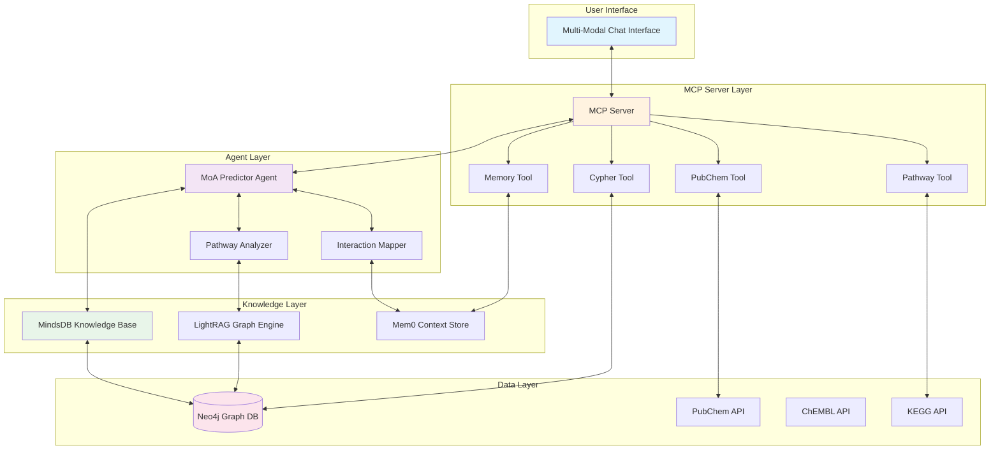
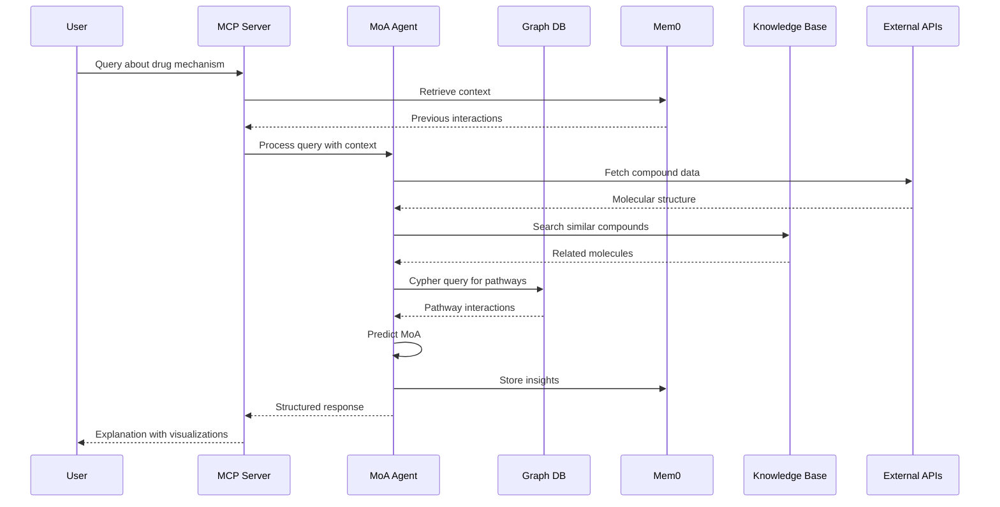

# 🧬 DietMOA Agent - Graph-Based Mechanism of Action Predictor

## 🎯 Project Overview

DietMOA Agent is a sophisticated multi-modal QA system that leverages graph-based reasoning to predict drug-target interactions and their downstream effects on human biological pathways. By combining MindsDB's knowledge bases with LightRAG's graph capabilities and Mem0's contextual memory, this system provides explainable, scientifically-grounded insights into molecular mechanisms of action.

### Key Features
- **Graph-Based Pathway Analysis**: Uses Cypher queries to traverse biological networks
- **Multi-Modal Understanding**: Processes chemical structures, protein sequences, and pathway diagrams
- **Contextual Memory**: Maintains conversation history and learned patterns
- **Real-time Data Integration**: Connects to PubChem, ChEMBL, and KEGG databases
- **MCP Server Architecture**: Modular, scalable design for dietary and nutritional analysis tools

## 🏗️ Repository Structure

```
dietmoa-agent/
├── README.md                   # This file
├── Makefile                    # Build and deployment automation
├── docker-compose.yml          # Container orchestration
├── .env.example               # Environment variables template
├── requirements.txt           # Python dependencies
├── package.json              # Node.js dependencies for MCP server
│
├── config/                    # Configuration files
│   ├── mindsdb_config.yml    # MindsDB connection settings
│   ├── lightrag_config.yml   # Graph database configuration
│   └── mem0_config.yml       # Memory system settings
│
├── mcp_server/               # MCP Server implementation
│   ├── __init__.py
│   ├── server.py            # Main MCP server
│   ├── tools/               # MCP tool implementations
│   │   ├── __init__.py
│   │   ├── pubchem_tool.py # PubChem API integration
│   │   ├── pathway_tool.py # Pathway analysis tool
│   │   ├── cypher_tool.py  # Graph query tool
│   │   └── memory_tool.py  # Memory management tool
│   └── handlers/            # Request handlers
│       ├── __init__.py
│       └── diet_handler.py
│
├── agents/                   # AI Agent modules
│   ├── __init__.py
│   ├── moa_predictor.py    # Main MoA prediction agent
│   ├── pathway_analyzer.py # Pathway impact analysis
│   └── interaction_mapper.py # Drug-target interaction mapping
│
├── graph/                    # Graph database layer
│   ├── __init__.py
│   ├── neo4j_client.py     # Neo4j connection manager
│   ├── schema/              # Graph schema definitions
│   │   ├── nodes.py        # Node types (Compound, Protein, Pathway)
│   │   └── relationships.py # Edge types (BINDS_TO, INHIBITS, ACTIVATES)
│   └── queries/             # Cypher query templates
│       ├── pathway_queries.cypher
│       └── interaction_queries.cypher
│
├── memory/                   # Memory management with Mem0
│   ├── __init__.py
│   ├── memory_manager.py    # Core memory operations
│   ├── context_store.py    # Conversation context storage
│   └── knowledge_graph.py  # Learned patterns storage
│
├── knowledge_base/          # MindsDB Knowledge Base
│   ├── __init__.py
│   ├── kb_manager.py       # Knowledge base operations
│   ├── embeddings/         # Vector embeddings
│   │   ├── molecular_embeddings.py
│   │   └── pathway_embeddings.py
│   └── indexes/            # Search indexes
│       └── diet_index.py
│
├── data_sources/           # External data integrations
│   ├── __init__.py
│   ├── pubchem_client.py  # PubChem API client
│   ├── chembl_client.py   # ChEMBL database client
│   ├── kegg_client.py     # KEGG pathway client
│   └── uniprot_client.py  # UniProt protein database
│
├── models/                 # Data models
│   ├── __init__.py
│   ├── compound.py        # Chemical compound model
│   ├── protein.py         # Protein/target model
│   ├── pathway.py         # Biological pathway model
│   └── interaction.py     # Drug-target interaction model
│
├── utils/                  # Utility functions
│   ├── __init__.py
│   ├── smiles_parser.py   # SMILES notation parser
│   ├── cypher_builder.py  # Dynamic Cypher query builder
│   └── visualization.py   # Graph visualization utilities
│
├── scripts/               # Deployment and setup scripts
│   ├── setup_databases.sh # Initialize databases
│   ├── load_pathways.py  # Import pathway data
│   ├── index_compounds.py # Index chemical compounds
│   └── start_services.sh # Start all services
│
├── tests/                 # Test suite
│   ├── __init__.py
│   ├── unit/             # Unit tests
│   │   ├── test_pubchem_tool.py
│   │   ├── test_cypher_queries.py
│   │   └── test_memory_manager.py
│   ├── integration/      # Integration tests
│   │   ├── test_mcp_server.py
│   │   ├── test_graph_traversal.py
│   │   └── test_knowledge_base.py
│   └── fixtures/         # Test data
│       ├── sample_compounds.json
│       └── sample_pathways.json
│
├── notebooks/            # Jupyter notebooks for demos
│   ├── 01_pathway_analysis.ipynb
│   ├── 02_drug_interaction.ipynb
│   └── 03_moa_prediction.ipynb
│
└── docs/                # Documentation
    ├── API.md          # API documentation
    ├── CYPHER_GUIDE.md # Cypher query examples
    └── SETUP.md        # Detailed setup instructions
```

## 📊 Available Resources

### Data Sources
- **PubChem**: 111M+ chemical compounds with bioactivity data
- **ChEMBL**: 2.2M+ bioactive molecules with drug-like properties
- **KEGG**: 18,000+ pathways across 500+ organisms
- **UniProt**: 570,000+ protein sequences with functional annotations
- **DrugBank**: 14,000+ drug entries with detailed pharmacology

### Pre-built Containers
```yaml
services:
  - neo4j:5.13 (Graph Database)
  - mindsdb:latest (AI/ML Platform)
  - lightrag:latest (Graph RAG Engine)
  - mem0:latest (Memory Management)
  - mcp-server:custom (Our MCP Server)
```

### Pre-trained Models
- **MolBERT**: Molecular structure embeddings
- **ProtBERT**: Protein sequence embeddings
- **PathwayGPT**: Pathway description understanding
- **BioBERT**: Biomedical text comprehension

## 🎯 Strategy & Architecture



### Workflow Sequence



## 🚀 Quick Start

### Prerequisites
- Docker & Docker Compose
- Python 3.9+
- Node.js 18+
- 16GB RAM minimum
- 50GB free disk space

### Installation

```bash
# Clone the repository
git clone https://github.com/yourusername/dietmoa-agent.git
cd dietmoa-agent

# Copy environment variables
cp .env.example .env
# Edit .env with your API keys

# Build and start services
make setup
make build
make start

# Initialize databases
make init-db

# Load initial data
make load-data

# Run tests
make test
```

## 📜 Scripts

### `scripts/setup_databases.sh`
Initializes Neo4j with dietary and nutritional graph schema and creates indexes for optimal query performance.

### `scripts/load_pathways.py`
Downloads and imports pathway data from KEGG, creating graph relationships between compounds, proteins, and pathways.

### `scripts/index_compounds.py`
Processes PubChem compounds, generates embeddings, and indexes them in MindsDB knowledge base.

### `scripts/start_services.sh`
Orchestrates the startup sequence of all services with health checks and dependency management.

## 🧪 Testing

### Unit Tests
```bash
make test-unit
```
- Tests individual components in isolation
- Validates Cypher query generation
- Verifies API client functionality

### Integration Tests
```bash
make test-integration
```
- Tests MCP server endpoints
- Validates graph traversal algorithms
- Verifies knowledge base queries

### End-to-End Tests
```bash
make test-e2e
```
- Simulates complete user interactions
- Tests memory persistence
- Validates MoA predictions

## 📈 Performance Metrics

- **Query Response Time**: < 2 seconds for simple queries
- **Graph Traversal**: < 500ms for 3-hop pathway analysis
- **Memory Retrieval**: < 100ms for context lookup
- **Embedding Generation**: < 200ms per molecule
- **Knowledge Base Search**: < 300ms for similarity search

## 🔧 Configuration

### MindsDB Configuration
```yaml
connection:
  host: localhost
  port: 47334
  database: diet_kb
  
knowledge_base:
  embedding_model: sentence-transformers/all-MiniLM-L6-v2
  chunk_size: 512
  overlap: 50
```

### LightRAG Configuration
```yaml
graph:
  provider: neo4j
  uri: bolt://localhost:7687
  max_depth: 5
  
rag:
  retrieval_method: hybrid
  top_k: 10
```

### Mem0 Configuration
```yaml
memory:
  provider: qdrant
  collection: diet_memory
  
context:
  window_size: 10
  ttl: 86400
```

## 🤝 Contributing

1. Fork the repository
2. Create a feature branch (`git checkout -b feature/amazing-feature`)
3. Commit your changes (`git commit -m 'Add amazing feature'`)
4. Push to the branch (`git push origin feature/amazing-feature`)
5. Open a Pull Request

## 📝 License

MIT License - see LICENSE file for details

## 🙏 Acknowledgments

- MindsDB team for the knowledge base platform
- LightRAG developers for graph RAG capabilities
- Mem0 team for memory management framework
- PubChem, ChEMBL, and KEGG for open dietary and nutritional data

## 📧 Contact

For questions or collaboration: dietmoa@example.com

---
Built with ❤️ for MindsDB Hacktoberfest 2025
